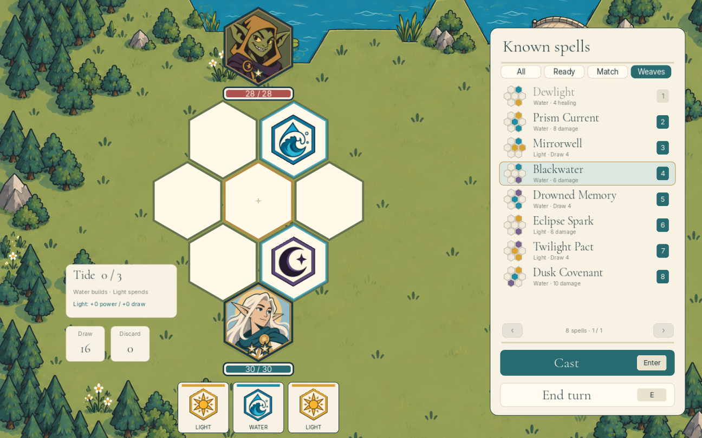

# The Hex Game

A playable Godot 4.6.3 card-game demo. Arrange elemental gems on a seven-hex board to cast spells, choose a class, and follow a five-fight overworld from Bat to Dragon. Version 0.7.0.



## Browser version

A browser export and GitHub Pages workflow are included. See [Web build and deployment](docs/WEB.md) for the one-time Pages setup and local preview instructions.

## Run from source

Import `source/project.godot` in Godot 4.6.3 and press **F5** to run the project. Alternatively, from the repository root:

```sh
godot --path source
```

Art, fonts and synthesized music are included. The game works offline; Python is only needed to regenerate music or analyze simulations.

## This update

Three distinct classes now have measured strengths and weaknesses, using 60,000 holdout fights across 12,000 seeded five-fight campaigns. The spell catalog contains 98 shared mixed-element weaves and 112 total possible patterns for each class, covering every pair and trio of the seven elements.

| Class | Starting gems | HP | Style |
| --- | --- | ---: | --- |
| Tidecaller | 9 Water / 11 Light | 30 | Build Tide with Water; spend it on Light for healing, damage or drawing. Reliable sustain, slower finishes. |
| Pyromancer | 14 Fire / 6 Air | 28 | Heat amplifies Fire, but overheated casting costs HP. Rare Air gems vent Heat into healing. |
| Nightbinder | 8 Dark / 12 Blood | 22 | Blood spends life for power; Dark steals life while attacking. Strong recovery with a fragile starting hand. |

See `analysis/BALANCE-REPORT.md` for win rates, confidence intervals, enemy matchups, reward effects and comparisons between planning, greedy and random policies. These measure simulated play, not human win rates. Raw data, analysis scripts and the standalone Godot simulator are included in `analysis/`.

Choose **Escape → Begin a new journey** to try the new starting compositions. Existing campaigns keep their exact saved gem counts. Updated class HP applies when a fight starts.

Captured gems combine with your existing deck through the shared weaves. Recipes appear when your actual deck supports their gem counts; duplicate rewards can unlock larger patterns. Each reward previews new combinations. Combat shows only spells you can cast right now, ordered by the number of runes they use; any finishing blow moves to the top. The spellbook's **All runes** view still shows future recipes and missing ingredients. See `RUNE-ATLAS.md` and `CLASS-GUIDE.md` for the complete catalog and class mechanics.

## Play

Follow the illustrated trail: **Bat → Goblin → Troll → Necromancer → Dragon**. Click the highlighted encounter tile, or press Enter, to travel into combat. Each victory unlocks the next fight. The Troll approach crosses the bridge, and the river gently flows downstream.

Use up to two casts per turn. Damage, healing and drawing are available. Click a known spell to fill it, then press **Enter** to cast. Alternatively drag a card onto a hex, or click a card then its destination. Click a placed gem to return it, or drag it between hexes. Rotated and reflected patterns count, but the center and spacing matter. Unavailable recipes leave your cards untouched.

**Pulse** uses any gem in the core and spends both casts as a fallback. Captured-gem spells use an outer hex instead. Draw spells need a cast left afterward. When no legal cast remains, the opponent's turn starts automatically after the effect finishes. Ending your turn returns uncast board gems to your hand.

The enemy also draws from a finite deck and keeps unused cards. Victories teach the next class pattern and offer a gem reward (choose one gem or skip). Every fight starts at full HP with your campaign deck shuffled. Defeat lets you retry without losing your deck.

Desktop and native play keep the full seven-hex board, hand, scenery, and drag controls. Portrait mobile browsers switch to a cleaner spell-command view: choose a large spell card, then cast it. Health, casts, and class resources remain visible, while the hand and rune board stay out of the way. Settings, help and the spellbook pause gameplay.

## Keyboard

| Key | Action |
| --- | --- |
| 1–9 | Fill the corresponding spell on the visible page |
| Enter / Space | Cast; Enter also starts the next fight or retries after defeat |
| Up / Down | Choose and fill the previous / next spell |
| A | Fill selected spell again |
| E | End turn |
| Backspace / Delete | Return placed gems to hand |
| B | Spellbook |
| H | Help |
| Escape | Settings / close ordinary overlay |

Settings contains music and sound toggles, your deck, spellbook, help, return to map, and a new-journey option. Victory requires an explicit gem or Skip click; Enter does not skip rewards accidentally.

## Encounters

Bat: 18 HP, one cast. Goblin: 28 HP, one cast. Troll: 42 HP, one cast. Necromancer: 52 HP, two casts. Dragon: 66 HP, two casts. Nine class spells unlock over the tutorial, plus spells for captured foreign elements.

## Development

Open `source/project.godot` in Godot 4.6.3. Rules and tuning are in `Rules.gd`; combat state in `Battle.gd`; rendering, map movement, input and audio in `Game.gd`; water animation in `River.gdshader`. Background scenery is raster art, while characters, buttons, health, cards and casting geometry are live Godot elements.

```sh
godot --headless --editor --path source --import
godot --headless --path source --script Tests.gd
godot --headless --path source --script TestBalanceAgent.gd
godot --path source --script TestUI.gd --audio-driver Dummy
```

`TestUI.gd` needs a display and writes screenshots under the ignored `source/test-output/` directory. It uses a separate temporary save. The macOS export preset is included; install the matching Godot export templates before exporting. Generated apps and packs are ignored. The original NumPy music composer is in `source/tools/compose_music.py`; prebuilt WAVs are included.

Save location: `~/Library/Application Support/Godot/app_userdata/Hexbound/progress.cfg`. The internal project name stays Hexbound to preserve saved progress.

## Validation

31,104 rules/regression checks, 175 rendered desktop/mobile interface and screenshot checks, and 405 simulation-agent checks passed from this repository copy. These cover every weave, class interactions, card conservation, rewards, saves, responsive browser controls, lethal spell ordering, input, audio transitions and simulation isolation. The agent cannot inspect the true draw order or mutate a live battle while planning.

The separate Monte Carlo experiment contains 60,000 fights with no turn-limit timeouts. Final parameters were frozen before holdout seeds were run. The original exported pack was launched in a separate muted window and its class selection and battle screens were visually checked. PR import validation is recorded in the pull request.

## Credits

Built with [Godot Engine](https://godotengine.org/) under its MIT license. Font licenses are in `source/assets/`. Inter and Cormorant Garamond use the included SIL Open Font License. Illustrations were generated during this design session. The original music uses synthesized instruments without downloaded samples.
