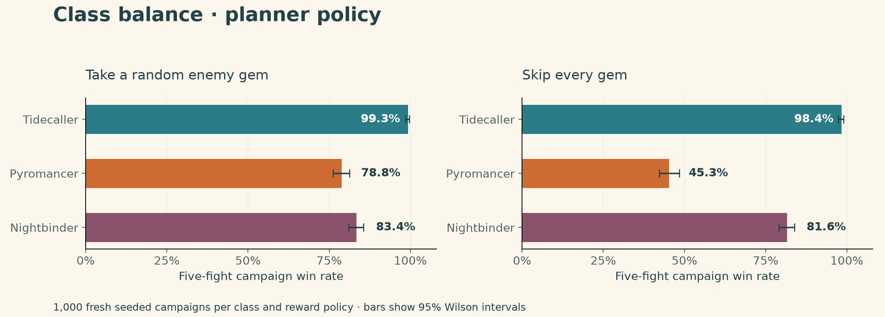
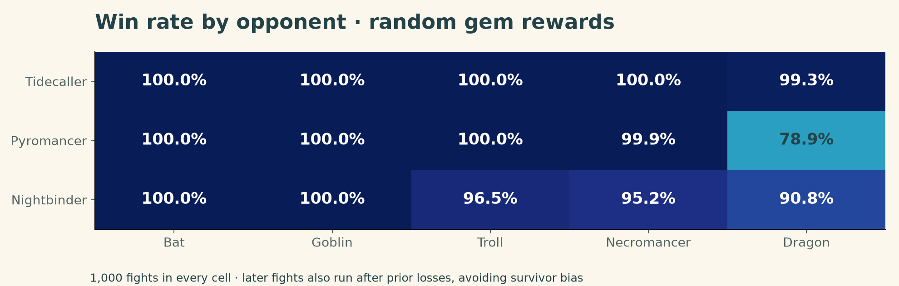

# The Hex Game — Monte Carlo balance report

Version 0.7.0 · 60,000 holdout fights · 12,000 five-fight campaigns · 2026-09-03

The final configuration was selected using separate exploratory seeds, then frozen before this holdout. Results measure simulated policies against the five tutorial enemies, not human win rates or player-versus-player balance.

## Main result

The primary comparison uses the planner policy and takes one uniformly random eligible enemy gem after each victory. Each class has 1,000 seeded campaign samples. A campaign win means winning all five fights without a defeat or retry. HP and class resources reset at each fight, as in the game.

| Class | Starting deck | HP | Campaign wins | Win rate (95% interval) |
| --- | --- | ---: | ---: | --- |
| Tidecaller | 9 Water / 11 Light | 30 | 993/1000 | 99.3% (98.6–99.7%) |
| Pyromancer | 14 Fire / 6 Air | 28 | 788/1000 | 78.8% (76.2–81.2%) |
| Nightbinder | 8 Dark / 12 Blood | 22 | 834/1000 | 83.4% (81.0–85.6%) |



## Strengths and costs

| Class | Mean turns per fight | HP spent on spells | HP restored | HP remaining |
| --- | ---: | ---: | ---: | ---: |
| Tidecaller | 4.07 | 0.00 | 14.45 | 21.20 |
| Pyromancer | 2.71 | 1.04 | 2.79 | 18.48 |
| Nightbinder | 3.11 | 6.81 | 14.87 | 16.44 |

Means include wins and losses, all five opponents, and random gem rewards. Restoration includes ordinary healing, life steal and venting; it is capped by missing HP. Remaining HP is zero on defeats.

- **Tidecaller:** the highest starting HP and more Light support a sustain-oriented plan. Water-to-Light sequencing converts preparation into damage, healing or extra draws. Its cost is slower finishing and fewer Water attack gems.
- **Pyromancer:** Fire-heavy draws and Heat support immediate damage, but Air is limited and overheated casts spend HP. New elements can supply recovery and alternatives when the opening deck runs hot.
- **Nightbinder:** powerful Blood spells and Dark life steal can finish quickly and recover while attacking. Its low HP and Blood-heavy draw distribution make paying for power dangerous, especially when Dark is unavailable.

These are design roles; the tables quantify their realized performance under the tested policies.

## Opponent matchups



| Class | Bat | Goblin | Troll | Necromancer | Dragon |
| --- | ---: | ---: | ---: | ---: | ---: |
| Tidecaller | 100.0% | 100.0% | 100.0% | 100.0% | 99.3% |
| Pyromancer | 100.0% | 100.0% | 100.0% | 99.9% | 78.9% |
| Nightbinder | 100.0% | 100.0% | 96.5% | 95.2% | 90.8% |

Every cell contains 1,000 fights. Later fights run even when an earlier one was lost, using the predetermined reward path. This produces unconditional matchup rates; it does not select only surviving campaigns. Campaign completion is the joint outcome across the same five fights.

## Reward sensitivity

| Class | Skip gems | Take random gems | Paired change (95% bootstrap interval) |
| --- | ---: | ---: | --- |
| Tidecaller | 98.4% | 99.3% | +0.9 points (+0.0 to +1.9) |
| Pyromancer | 45.3% | 78.8% | +33.5 points (+29.4 to +37.6) |
| Nightbinder | 81.6% | 83.4% | +1.8 points (-1.6 to +5.2) |

Random rewards are not optimized drafting. Enemy reward pools favor Dark, Blood and Earth before the Dragon. That gives the classes different opportunities to add new elements; Nightbinder starts with two of those elements already. Fire/Air rewards from the Dragon cannot affect an earlier fight.

## Policy sensitivity

Each planner condition has 1,000 campaigns. Greedy and random conditions each have 500.

| Class | Planner, skip | Planner, take | Greedy, skip | Greedy, take | Random, skip | Random, take |
| --- | ---: | ---: | ---: | ---: | ---: | ---: |
| Tidecaller | 98.4% | 99.3% | 69.6% | 87.6% | 0.0% | 0.6% |
| Pyromancer | 45.3% | 78.8% | 50.6% | 67.8% | 0.4% | 2.2% |
| Nightbinder | 81.6% | 83.4% | 65.4% | 74.0% | 0.2% | 0.0% |

- **Planner:** evaluates two casts within the current turn using the real battle engine. It scores damage, recovery and class resources. Draw spells use three hypothetical samples from the sorted unseen card multiset, not the true draw order. It does not search future enemy turns or know enemy hands.
- **Greedy:** uses the same utility calculation but scores one cast at a time. It is not purely maximum damage and is not guaranteed to underperform the planner.
- **Random:** chooses uniformly among legal spells, including Pulse. It never deliberately makes an invalid layout, so even this is not a model of an entirely new human player.

## Spell usage

The catalog contains 98 shared weaves and 112 total possible patterns per class, including its class spells and simple runes. Each particular campaign only learns patterns supported by its actual gem counts and encounter progression.

| Class | Distinct spells used | Mixed-weave share of casts | Most cast spells |
| --- | ---: | ---: | --- |
| Tidecaller | 49 | 36.0% | Tidal Bolt (18%), Mend (11%), Sunshard (11%) |
| Pyromancer | 44 | 55.7% | Kindle (23%), Furnace Gale (18%), Firewhirl (15%) |
| Nightbinder | 20 | 30.0% | Blood Offering (18%), Soul Feast (18%), Blood Hex (15%) |

## What this suggests for the demo

- Tidecaller is the forgiving planning class. Its sustain trades speed for safety; its near-ceiling planner win rate leaves little difficulty headroom for experienced players.
- Pyromancer offers the fastest fights and the strongest measured benefit from gem rewards. Skipping upgrades is a substantial self-imposed challenge.
- Nightbinder spends much more HP to cast and recovers through attacks. Its thinner starting health and poor random-policy performance make recovery sequencing an important tutorial lesson.
- These classes intentionally do not have equal win rates. This experiment measures the current tutorial configuration; it does not establish that the classes are equally enjoyable or that every spell is balanced.

Full counts are in `spell-usage.csv`. Do not interpret usage as a causal measure of spell power: availability, deck composition and policy preferences all affect it.

## Validation and reproduction

- 31,102 rules/regression checks, 125 rendered interface checks and 405 agent-isolation checks passed. Agent checks verify legal choices, no mutation of the real battle, and invariance to permutations of the hidden pile.
- Every simulation checks player and enemy card conservation and stops at 40 rounds. There were no timeouts in the holdout.
- Confidence intervals are 95% Wilson intervals. Reward effects use a paired bootstrap over 1,000 shared seed IDs with 10,000 resamples. Seed IDs are paired across classes and reward policies; do not treat every row as an independent campaign.
- Holdout seeds are 10,000–10,999 for the planner and 10,000–10,499 for the other policies. Tuning seeds were 0–29, 200–299 and 400–499. No holdout result was used to retune this version.
- All combat resolution comes from `Battle.gd`. The older rules-test bot is not used for these Monte Carlo results.
- The standalone reproduction project matched all ten per-fight rows for a checked seed exactly.

From the analysis folder, reproduce one condition with Godot 4.6.3:

```sh
godot --headless --path reproduce --script MonteCarlo.gd --log-file ./simulation.log -- --classes=tide --policies=planner --n=1000 --seed=10000 --out=/absolute/path/to/results
```

To rerun all six conditions, run `python3 reproduce/run_all.py --godot /path/to/godot --out /absolute/path/to/results`. The bundled `reproduce/analyze.py` regenerates tables and figures; install its `requirements.txt` first, then run `python3 reproduce/analyze.py /absolute/path/to/results`.

Use `--policies=greedy,random --n=500` for the sensitivity run. The default reward conditions are `skip,random`. `experiment-plan.json` records the frozen configuration; `source-sha256.json` fingerprints the exact rules and simulator. Raw per-fight CSVs and summary JSONs are in the six class/policy folders.
